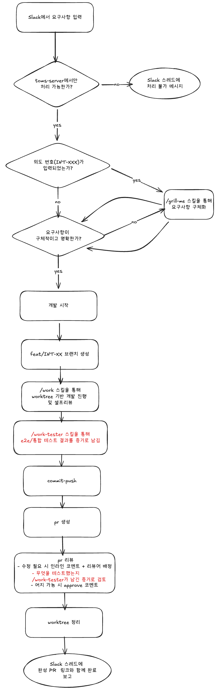

### Today I Learn 25.05.21

#### 1. Slack -> 자동 개발 -> PR 파이프라인
* 자동 개발된 산출물을 어떻게 믿을 것인가? 에 대한 고민이 많았는데 준형님의 아이디어를 차용했다.
  * 테스트 결과를 저장해놓고 해당 결과를 PR 리뷰 스킬로 검증
    

#### 2. 멘토링
* **Shift-Left**에 대한 개념을 처음 알게 되었다.
  * TDD는 구현 이전에 테스트 코드를 먼저 작성하는 것이라면, Shift-Left는 테스트를 더 앞단으로 당기자는 개념
  * 구체적으로는 서비스 배포를 먼저 해두고, 배포된 상태에서 테스트부터 작성하자는 기조
    * 배포 환경 구축(Docker, CI/CD 등) -> 빈 서비스 배포 -> 테스트 코드 -> 구현
  * 배포 완료를 가정한 사이클을 미리 돌려봄으로써 "방화벽 설정이 안 되어 있었다", "DB에 필요한 게 없었다" 등의 사고를 미연에 방지할 수 있음

#### 3. 회고
* 잘 한점: 준형님의 개발 스킬을 내 상황에 적절히 적용했다.
* 아쉬웠던 점: 컨텍스트 스위칭이 너무 자주 일어나면 정신을 못 차리겠다. 
* 내일 개선할 행동: 타임 블록 잡기, 작업 전환 시에 간단히 메모 남겨보기